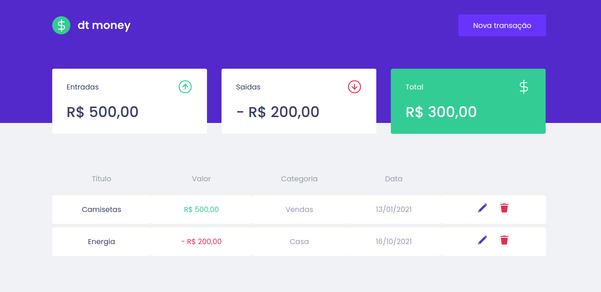
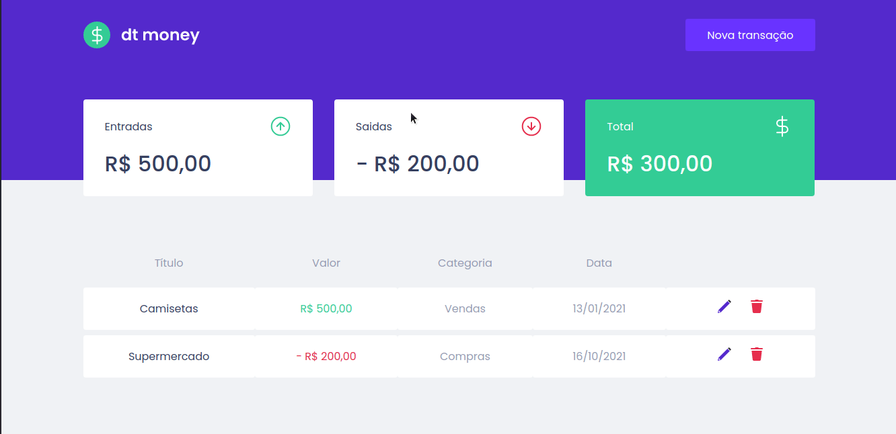

<h1 align="center">
  DT_MONEY
</h1>

  <a href="#-tecnologias">Tecnologias</a>&nbsp;&nbsp;&nbsp;|&nbsp;&nbsp;&nbsp;
  <a href="#-projeto">Projeto</a>&nbsp;&nbsp;&nbsp;|&nbsp;&nbsp;&nbsp;
  <a href="#-layout">Layout</a>&nbsp;&nbsp;&nbsp;|&nbsp;&nbsp;&nbsp;
  <a href="#-como-executar">Como executar</a>&nbsp;&nbsp;&nbsp;|&nbsp;&nbsp;&nbsp;
  <a href="#-executando-a-aplicação">Executando a aplicação</a>

## 🚀 Tecnologias

Esse projeto foi desenvolvido com as seguintes tecnologias:

- [React](https://reactjs.org)    
  
- [TypeScript](https://www.typescriptlang.org/)    

## 💻 Projeto

O dt_money é uma aplicação que permite você ter o controle dos seus gastos, onde nela você pode ver suas entradas e saídas além de poder conferir o seu saldo.

## ✨ Layout

  

## 🔖 Como executar

- Clone o repositório
- Instale as dependências com `yarn`
- Inicie o servidor com `yarn start`

Agora você pode acessar [`localhost:3000`](http://localhost:3000) do seu navegador.

## 🎬 Executando a aplicação

  

